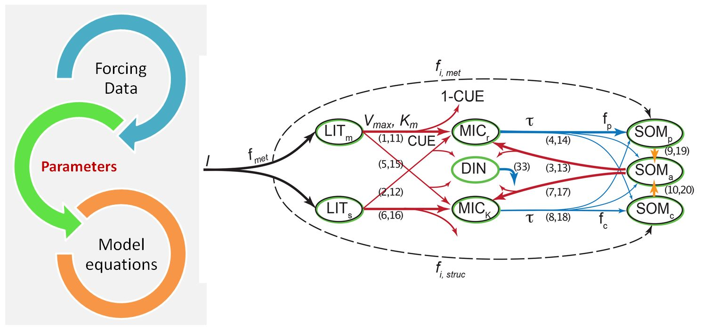

```{r message=FALSE}
library(dplyr)
library(tidyverse)
library(ggplot2)
library(knitr)
library(DT)
library(gridExtra)
library(grid)
library(ggpubr)
library(readxl)
library(viridis)
library(reshape)

#for MIMICS
library(rootSolve)
library(boot)

#for maps
library(rgdal)
library(leaflet)

options(ggplot2.continuous.colour="viridis")
options(ggplot2.continuous.fill = "viridis")
options(width = 100)
```


### The process thus far...

{width=89%}

- Is the forcing data right or wrong?

- Or, are the parameters just not right?

- Or, do the model relationships need to change? 

***

### Goal: Faster, more intuitive parameterizations of MIMICS

##### Brute force the paramaters!

- Run the model 1000+ times with random parameters.
- Observe effects on model outcomes: Residuals, pools, RMSE, r^2, etc.
- Visualize relative effects from changing different parameters
- Find the best fit!

***

