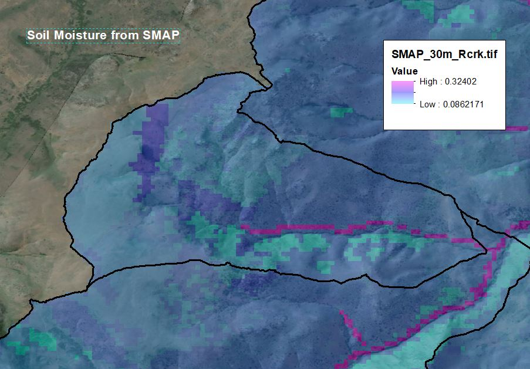
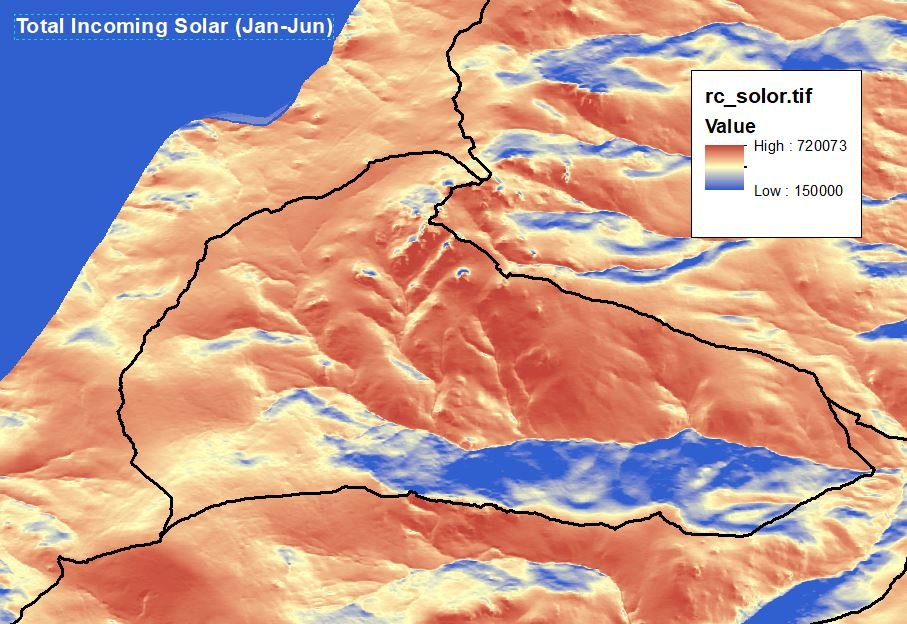
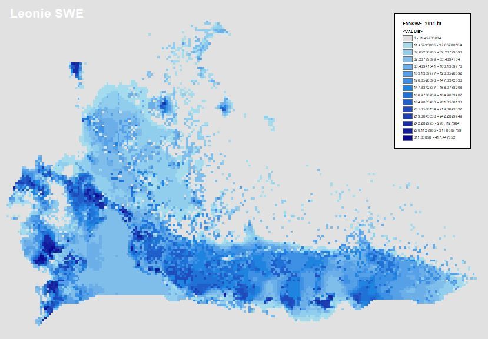

```{r message=FALSE}
library(dplyr)
library(tidyverse)
library(ggplot2)
library(knitr)
library(DT)
library(gridExtra)
library(grid)
library(readxl)
library(leaflet)
library(viridis)
library(reshape)

#for MIMICS
library(rootSolve)
library(boot)

options(ggplot2.continuous.colour="viridis")
options(ggplot2.continuous.fill = "viridis")
options(width = 100)
```


## SMAP and incoming solar

### Does soil moisture or temperature explain RCrk-MIMICS residuals?

***

- Recent MIMICS run have not included the influence of water (e.g. neither MAP nor soil moisture)

- Soil temperature has been modeled with MAT (air temperature), which does not reflect known differences in soil temperature across the diverse RCrk terrain.


#### New climate layers: SMAP and DEM based incoming solar radiation.

{width=49%} {width=49%}

***

<br>

### SMAP vs. MIMICS residual error

- Nothing obvious stands out with all data viewed together

```{r}
MIMrun_gis <- read.csv("C:/Users/Derek/Google Drive/RCrk/GIS/Pierson_compile/MIMout_SMAP+Solar.csv")

ggplot(MIMrun_gis, aes(y=SMAP_30m_R, x=residual)) + geom_point()

```


- When plotting just the north aspect slopes, ~1/2 the data fits on a trendline


```{r}
ggplot(MIMrun_gis %>% filter(ASPECT_CLA %in% c("North", "Northeast", "Northwest")), 
       aes(y=SMAP_30m_R, x=residual, color=L1)) + geom_point() +
       geom_abline(intercept = 0.135, slope = 0.002, color="black", linetype="dashed", size=0.5) +
  ggtitle("SMAP vs. Residuals - Northern aspects only")

```


***

### Incoming Solar vs. MIMICS residual error

- Threshold half way up the plot?

- All of the higher residuals fall into the bottom right (Less sunlight).

- In reality, the lack of sunlight in some areas is probably magnified by canopy interception.

```{r}
MIMrun_gis <- read.csv("C:/Users/Derek/Google Drive/RCrk/GIS/Pierson_compile/MIMout_SMAP+Solar.csv")

ggplot(MIMrun_gis, aes(y=rc_solor, x=residual, color=L1)) + geom_point()

ggplot(MIMrun_gis, aes(y=rc_solor, x=residual, color=pGPP+400)) + geom_point(size=4) +
  ggtitle("Sunlight:ANPP")

```


### Looking at solar across the northern aspects only

```{r}
#northern aspects
ggplot(MIMrun_gis %>% filter(ASPECT_CLA %in% c("North", "Northeast", "Northwest")), 
       aes(y=rc_solor, x=residual, color=ASPECT_CLA)) + geom_point() +
       geom_abline(intercept = 0.135, slope = 0.002, color="black", linetype="dashed", size=0.5) +
  ggtitle("Incoming Solar vs. Residuals - Northern aspects only") +
  xlim(-7,6)

#without northwest
ggplot(MIMrun_gis %>% filter(ASPECT_CLA %in% c("North", "Northeast")), 
       aes(y=rc_solor, x=residual, color=ASPECT_CLA)) + geom_point() +
       geom_abline(intercept = 0.135, slope = 0.002, color="black", linetype="dashed", size=0.5) +
  ggtitle("Incoming Solar vs. Residuals - NE and NW only")+
  xlim(-7,6)

```

## Conclusions

- Unsure if SMAP will improve residuals...but we need water in the model, correct?

- Solar clearly has a relationship with the residuals. Move on to incorperating solar in the model.  

***

***


### One more option for water inputs:

**- SWE from Leonie**

{width=85%}

