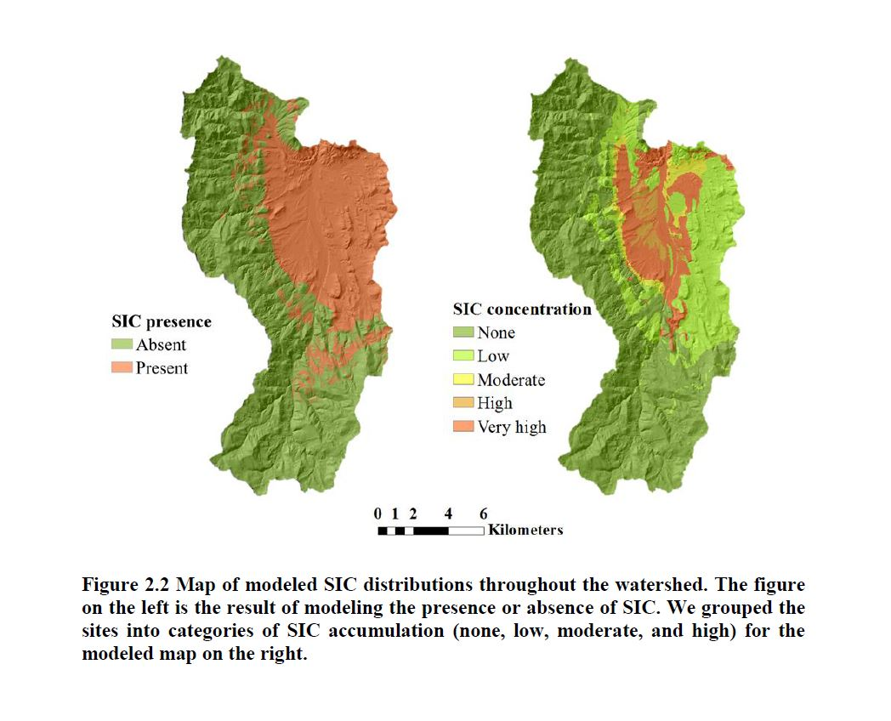
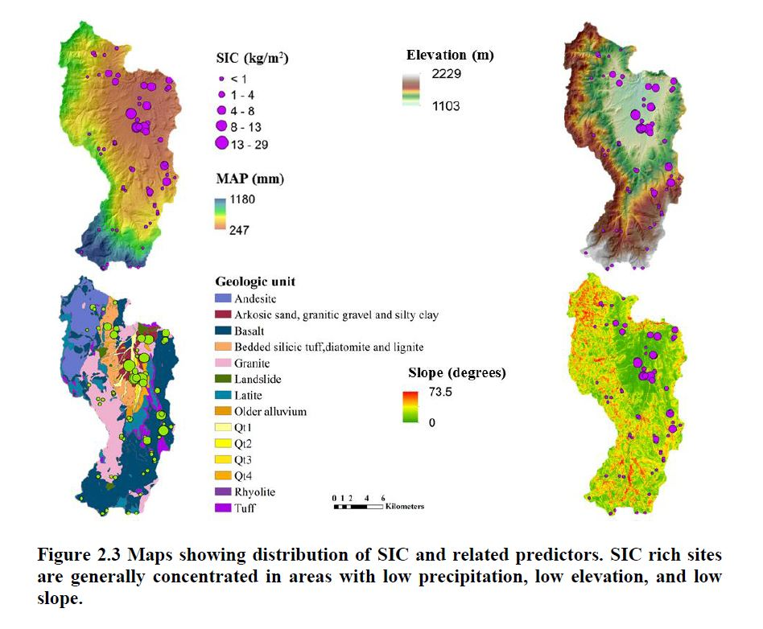

```{r message=FALSE}
library(dplyr)
library(tidyverse)
library(ggplot2)
library(knitr)
library(DT)
library(gridExtra)
library(grid)
library(ggpubr)
library(readxl)
library(viridis)
library(reshape)

#for MIMICS
library(rootSolve)
library(boot)

#for maps
library(rgdal)
library(leaflet)

options(ggplot2.continuous.colour="viridis")
options(ggplot2.continuous.fill = "viridis")
options(width = 100)
```

### Compiling SIC pools from 0-30 cm
Uses the data aggregation scripts I built for SoDaH in October 2020. Currently stored in lter-SoDaH repository under data aggregation. 
(Note: The data aggregation scripts still contain bugs and need more testing.)

<br> 

**RESULT :** The patton data only has ~3 locations with any SIC in the top 30 cm.

* Table column "analyte_avg" contains values for profile SIC stocks in kg C m-2

```{r warning=FALSE, message=FALSE, results=FALSE, out.width = '80%' }

# Bring in scripts
  # Filepaths have to match in source scripts
source("C:/github/lterwg-som/data-aggregation/Summary tbl/get_analyte_avgs_ftn.R")

# Get RC SoDaH from local path
RC_SoDaH <- readRDS("C:/GitHub/RC-som-shiny/shiny_SOM/RC_database_current.rds")
  #colnames(RC_SoDaH)

# Run ftn to get analyte avgs for all locations and depths,
# as well as avgs to the specified depth
get_analyte_avgs(target_database = RC_SoDaH,
                 target_analyte_to_avg = "lyr_sic_stock",
                 target_depth_cm = 30)
```

```{r message=FALSE, warning=FALSE}
library(DT)
datatable(avg_toDepth_lyr_sic_stock_raw[,c(3:4,7:ncol(avg_toDepth_lyr_sic_stock_raw))], 
          rownames = FALSE, 
          #filter="top", 
          options = list(pageLength = 20),
          class = "display nowrap")
```

<br>

***

<br>

### Map of profile SIC stocks from Patton & Stanbery datasets

```{r message=FALSE, warning=FALSE, out.width = '100%', fig.width=10, fig.height=10}
# bring in the data
rc_prof_sic <- read.csv("C:/Users/Derek/Google Drive/RCrk/GIS/SIC_DNP/Patton_Stanbery_profileSIC.csv", as.is=T)


#create basemap
#Bring in RC boundary
rc_watersheds <- readOGR("C:/github/RC-som-shiny/prototype/RCproto/map/watersheds_2014.shp", layer="watersheds_2014")
rc_watersheds <- spTransform(rc_watersheds, CRS("+proj=longlat +datum=WGS84 +no_defs"))

my_map <- leaflet() %>% setView(lng = -116.78, lat = 43.17, zoom = 11) %>%   #43.12222, -116.7817
        addProviderTiles(
        "Esri.WorldTopoMap",
        # give the layer a name
        group = "Esri.WorldTopoMap"
      ) %>%
        addProviderTiles(
        "OpenStreetMap",
        # give the layer a name
        group = "OpenStreetMap"
      ) %>%
        addProviderTiles(
          "Stamen.Toner",
          group = "Stamen.Toner"
        ) %>%
        addProviderTiles(
          "Stamen.Terrain",
          group = "Stamen.Terrain"
        ) %>%
        addProviderTiles(
          "Esri.WorldStreetMap",
          group = "Esri.WorldStreetMap"
        ) %>%
        addProviderTiles(
          "Wikimedia",
          group = "Wikimedia"
        ) %>%
        addProviderTiles(
          "CartoDB.Positron",
          group = "CartoDB.Positron"
        ) %>%
        addProviderTiles(
          "Esri.WorldImagery",
          group = "Esri.WorldImagery"
        ) %>%
      # add a layers control
      addLayersControl(
        baseGroups = c(
          "Esri.WorldTopoMap", "OpenStreetMap", "Stamen.Toner","Stamen.Terrain", "Esri.WorldStreetMap",
          "Wikimedia", "CartoDB.Positron", "Esri.WorldImagery"
        ),        
        # position it on the topleft
        position = "topleft"
      )  %>%
        addPolygons(data=rc_watersheds,
                  col = 'black',
                  stroke = TRUE, 
                  weight=2,
                  opacity=1,
                  fillColor="grey90",
                  fillOpacity = 0.05, 
                  smoothFactor = 2)

#create map color bins
rc_prof_sic$SICbins <- cut(rc_prof_sic$ProfileSIC_kgm2, 
                        c(0,1,5,10,20,30,40), include.lowest = T,
                        labels = c('0', '0-1', '1-5', '5-10', '10-20','30-40'))

# then assign a palette to this using colorFactor
# in this case it goes from red for the smaller values to yellow and green
# standard stoplight for bad, good, and best
SICCol <- colorFactor(palette = 'YlOrRd', rc_prof_sic$SICbins)


my_map %>% addCircleMarkers(data=rc_prof_sic, lat=~lat, lng=~long, 
             popup=~paste0("SIC: ",as.character(ProfileSIC_kgm2)," kg C m-2"),
             color = ~SICCol(SICbins),
             stroke = FALSE, 
             fillOpacity = 0.8,
             radius=5) 

```

<br>

***

### Plot SIC by Elevation

```{r}
ggplot(rc_prof_sic, aes(x=elev, y=ProfileSIC_kgm2, color=SICbins)) + 
  geom_point(size=2, alpha=0.8) +
  scale_colour_manual(values = c("#f0f0a1", "#FED976", "#FEB24C", "#FD8D3C", "#F03B20", "#BD0026")) +
  theme_bw() +
  xlab("Elevation (m)") +
  ylab("Profile SIC Stock (kg m-2)") + 
  theme(legend.position = "none") +
  labs(title = "Reynolds Creek SIC by Elevation", subtitle = "Data from Patton & Stanbery")


```

<br>

***

### Stanbery thesis maps of SIC

**What's the backstory? Why not published? Spatial kriging attempted?**
<br>
[Stanbery et al., SIC on the Rocks, Catena 2017 ](https://www.sciencedirect.com/science/article/abs/pii/S0341816217302102?casa_token=3UpdOf8AmxgAAAAA:k-flT1BUWJyUjKBlfA36SZPy4IDNv-7At4jY949q_H7Jtesu8Iuv3UmddpdwA7wgEp1iavFaGqM)
<br>
[Stanbery MS Thesis - PDF](http://scholarworks.boisestate.edu/cgi/viewcontent.cgi?article=2282&context=td)
<br>


<br>


