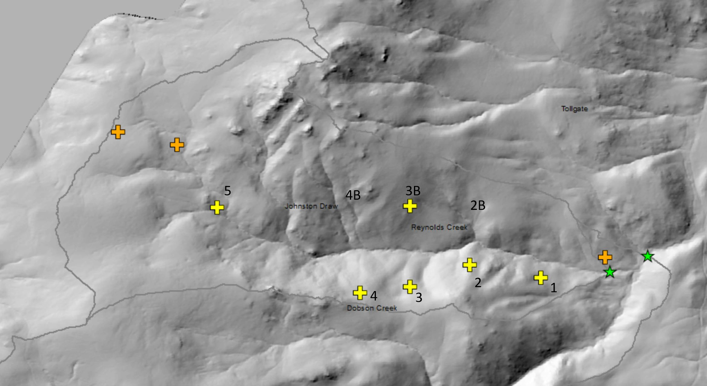
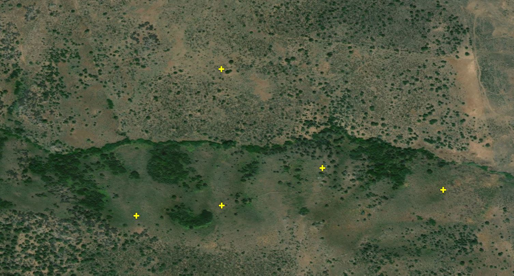
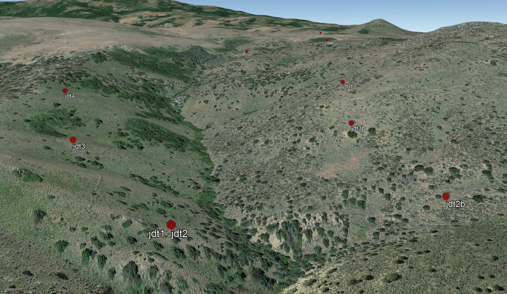

```{r echo=FALSE, message=FALSE}
library(dplyr)
library(tidyverse)
library(ggplot2)
library(knitr)
library(DT)
library(gridExtra)
library(grid)

```


## Goal: Quantify the annual the effect of aspect on soil moisture in Johnston Draw

[Data source](https://data.nal.usda.gov/dataset/data-eleven-years-mountain-weather-snow-soil-moisture-and-stream-flow-data-rain-snow-transition-zone-johnston-draw-catchment-reynolds-creek-experimental-watershed-and-critical-zone-observatory-usa-v11/resource/90dc08fa-f6c5-443a-8b74-15f1697cd330) 
S. E. Godsey, D. Marks, P. Kormos, M. Seyfried, Enslin, C., J. McNamara and T. Link, 2017, Eleven years of mountain weather, snow, soil moisture and stream flow data from the rain-snow transition zone - the Johnston Draw catchment, Reynolds Creek Experimental Watershed and Critical Zone Observatory, USA, Ag Data Commons, USDA Agricultural Library, http://dx.doi.org/10.15482/USDA.ADC/1402076.

***
<center>
#### Rough map of soil moisture probes in Johnston Draw (# 1-5)

<span style="font-size: 12px">Reynolds Creek mean annual precipitation</span>
<br>
{width=80%}
</center>

***

#### Part 1: Prepare soil moisture probe data

***


```{r message=FALSE, warning=FALSE, results='hide'}
# Function to read, clean and make daily averages from the raw soil moisture data files
get_daily_JD_sm <- function(file_loc) {
  
  loc_name <- strsplit(file_loc, "[.]")[[1]][4]
  print(loc_name)
  
  #read in file
  raw_soil_mst <- read.csv(file_loc, as.is=T)
  
  #format date
  raw_soil_mst$form_Date <- as.POSIXct(raw_soil_mst$Date_time)
  
  #remove rows with missing near surface values
  clean_soil_mst <- raw_soil_mst %>% filter(s_m_5 != -9999 &
                                            s_m_20 != -9999) # &
                                            #s_m_50 != -9999 &
                                            #s_m_75 != -9999)
  
  #get daily avg soil moisture
  dayavg_soil_mst <- clean_soil_mst %>% group_by(WY, Year, Month, Day) %>% summarise_all(mean)
  
  #remove if not a full day
  dayavg_soil_mst <- dayavg_soil_mst %>% filter(Hour == 11.5)
  
  #rebuild full date column
  dayavg_soil_mst$Date_time <- as.Date(with(dayavg_soil_mst, paste(Year, Month, Day,sep="-")), "%Y-%m-%d")
  
  #get monthly avg
  #monthavg_soil_mst <- dayavg_soil_mst %>% group_by(WY, Year, Month) %>% summarise_all(mean)
  
  #remove if not close to a full month
  #monthavg_soil_mst <- monthavg_soil_mst %>% filter(Day > 14 & Day < 17)
  
  #rebuild full date column
  #monthavg_soil_mst$Date_time <- as.Date(with(monthavg_soil_mst, paste(Year, Month, 1, sep="-")), "%Y-%m-%d")
  
  dayavg_soil_mst$Site <- loc_name
  
  output_df <- dayavg_soil_mst %>% select(Site, WY, Year, Month, Date_time, s_m_5, s_m_20, T_g_5, T_g_20)
  
  return(as.data.frame(output_df))
}


### Use ftn to compile the soil moisture data into one dataframe 

#set path to soil moisture data
jd_soilmst_data_path <- "C:/Users/drkpi/Google Drive/RCrk/RC_SoDaH/RC_data/ARS_climate/Godsey JDraw Soil Moisture/raw data/"

#get ARS siol moisture data files from path
soil_mst_files <- list.files(jd_soilmst_data_path)
soil_mst_files <- soil_mst_files[!soil_mst_files %in% c('desktop.ini')]
path_soil_mst_files <- paste0(jd_soilmst_data_path, soil_mst_files)

loc_ids <- sapply(strsplit(soil_mst_files, "[.]"), "[[", 4)

#test for a single file/site
ftn_out_test <- get_daily_JD_sm(path_soil_mst_files[1])

#Compile from all ARS files
JD_sm_df <- sapply(path_soil_mst_files, get_daily_JD_sm, simplify=FALSE)
JDSM <- do.call(bind_rows, JD_sm_df)

```

<details style="padding: 30px">
  <summary><span style="font-size: 16px">Click to see head of soil moisture table</span></summary>
```{r echo=FALSE, results = 'asis'}
kable(JDSM[1:10,], caption="Daily soil moisture from Johnston Draw probes", digits=3)
print("Continues for 12058 rows")
```
</details> 


### Johnston Draw 2

* Plot comparison of soil moisture for north and south aspect
* Calculate daily avg difference between aspects
* Summarize aspect difference by month


```{r message=FALSE, warning=FALSE, results='hide'}

jd2 <- ggplot(JDSM %>% filter(Site == "jd-jdt2_stm"), aes(x=Date_time, y=s_m_5, color=Month)) + geom_point() +
  scale_color_gradientn(colors = rainbow(12)) + theme_dark() +
  xlim(c(as.Date('2010-09-1', format = "%Y-%m-%d"), as.Date('2015-01-01', format = "%Y-%m-%d"))) +
  ylim(0,0.45) + 
  ggtitle("jdt-2 (North facing): Soil moisture @ 5 cm") #+ 
  #theme(legend.position = "none")

jd2b <- ggplot(JDSM %>% filter(Site == "jd-jdt2b_stm"), aes(x=Date_time, y=s_m_5, color=Month)) + geom_point() +
  scale_color_gradientn(colors = rainbow(12)) + theme_dark() +
  xlim(c(as.Date('2010-09-1', format = "%Y-%m-%d"),as.Date('2015-01-01', format = "%Y-%m-%d"))) +
  ylim(0,0.45) + 
  ggtitle("jdt-2B (South facing): Soil moisture @ 5 cm")


#Calculate diff 

jd2_df <- JDSM %>% filter(Site == "jd-jdt2_stm") %>% select(Date_time, Month, s_m_5) %>% rename(jd2_sm5 = s_m_5)
jd2b_df <- JDSM %>% filter(Site == "jd-jdt2b_stm") %>% select(Date_time, Month, s_m_5) %>% rename(jd2b_sm5 = s_m_5)
jd2_merge_df <- left_join(jd2_df, jd2b_df) %>% na.omit()
jd2_merge_df$diff <- jd2_merge_df$jd2_sm5 - jd2_merge_df$jd2b_sm5


jd2_diff <- ggplot(jd2_merge_df, aes(x=Date_time, y=diff, color=Month)) + geom_point() +
  scale_color_gradientn(colors = rainbow(12)) + theme_dark() +
  xlim(c(as.Date('2010-09-1', format = "%Y-%m-%d"),as.Date('2015-01-01', format = "%Y-%m-%d"))) +
  ylim(-0.16,0.16) + 
  ggtitle("jdt-2 (Difference: North-South): Soil moisture @ 5 cm") + 
  geom_hline(yintercept=0, linetype="dashed", color = "black", size=2, alpha=0.5)

#Monthly average diff

jd2_monthly_diff <- jd2_merge_df %>% select(Month, diff) %>% group_by(Month) %>%
                      summarize(diff_avg = mean(diff),
                                diff_sd = sd(diff))

jd2_monthly_diff_plot <- ggplot(jd2_monthly_diff, aes(x=Month, y=diff_avg, fill=Month)) + geom_bar(stat = "identity") +
  scale_fill_gradientn(colors = rainbow(12)) + theme_dark() +
  scale_x_continuous(breaks=seq(1,12,1)) +
  geom_errorbar(aes(ymin=diff_avg-diff_sd, ymax=diff_avg+diff_sd), alpha=0.3, width=0.2) +
  ggtitle("jdt-2 (Difference: North - South): Soil moisture @ 5 cm") + 
  geom_hline(yintercept=0, linetype="solid", color = "black", size=2, alpha=0.5) +
  theme(axis.line = element_line(colour = "black"),
    panel.grid.major = element_blank(),
    panel.grid.minor = element_blank()) +
  geom_text(x=6, y=-0.12, label="South slope wetter") +
  geom_text(x=6, y=0.12, label="North slope wetter") +
  ylim(-0.16,0.16)

grid.arrange(jd2, jd2b, ncol = 1)
grid.arrange(jd2_diff, jd2_monthly_diff_plot, ncol = 1)

```

### Johnston Draw 3
```{r echo=FALSE, message=FALSE, warning=FALSE, results='hide'}

jd3 <- ggplot(JDSM %>% filter(Site == "jd-jdt3_stm"), aes(x=Date_time, y=s_m_5, color=Month)) + geom_point() +
  scale_color_gradientn(colors = rainbow(12)) + theme_dark() +
  xlim(c(as.Date('2010-09-1', format = "%Y-%m-%d"), as.Date('2015-01-01', format = "%Y-%m-%d"))) +
  ylim(0,0.45) + 
  ggtitle("jdt-3 (North facing): Soil moisture @ 5 cm") #+ 
  #theme(legend.position = "none")

jd3b <- ggplot(JDSM %>% filter(Site == "jd-jdt3b_stm"), aes(x=Date_time, y=s_m_5, color=Month)) + geom_point() +
  scale_color_gradientn(colors = rainbow(12)) + theme_dark() +
  xlim(c(as.Date('2010-09-1', format = "%Y-%m-%d"),as.Date('2015-01-01', format = "%Y-%m-%d"))) +
  ylim(0,0.45) + 
  ggtitle("jdt-3B (South facing): Soil moisture @ 5 cm")


#Calculate diff 

jd3_df <- JDSM %>% filter(Site == "jd-jdt3_stm") %>% select(Date_time, Month, s_m_5) %>% rename(jd3_sm5 = s_m_5)
jd3b_df <- JDSM %>% filter(Site == "jd-jdt3b_stm") %>% select(Date_time, Month, s_m_5) %>% rename(jd3b_sm5 = s_m_5)
jd3_merge_df <- left_join(jd3_df, jd3b_df) %>% na.omit()
jd3_merge_df$diff <- jd3_merge_df$jd3_sm5 - jd3_merge_df$jd3b_sm5


jd3_diff <- ggplot(jd2_merge_df, aes(x=Date_time, y=diff, color=Month)) + geom_point() +
  scale_color_gradientn(colors = rainbow(12)) + theme_dark() +
  xlim(c(as.Date('2010-09-1', format = "%Y-%m-%d"),as.Date('2015-01-01', format = "%Y-%m-%d"))) +
  ylim(-0.16,0.16) + 
  ggtitle("jdt-3 (Difference: North-South): Soil moisture @ 5 cm") + 
  geom_hline(yintercept=0, linetype="dashed", color = "black", size=2, alpha=0.5)

#Monthly average diff

jd3_monthly_diff <- jd3_merge_df %>% select(Month, diff) %>% group_by(Month) %>%
                      summarize(diff_avg = mean(diff),
                                diff_sd = sd(diff))

jd3_monthly_diff_plot <- ggplot(jd3_monthly_diff, aes(x=Month, y=diff_avg, fill=Month)) + geom_bar(stat = "identity") +
  scale_fill_gradientn(colors = rainbow(12)) + theme_dark() +
  scale_x_continuous(breaks=seq(1,12,1)) +
  geom_errorbar(aes(ymin=diff_avg-diff_sd, ymax=diff_avg+diff_sd), alpha=0.3, width=0.2) +
  ggtitle("jdt-3 (Difference: North - South): Soil moisture @ 5 cm") + 
  geom_hline(yintercept=0, linetype="solid", color = "black", size=2, alpha=0.5) +
  theme(axis.line = element_line(colour = "black"),
    panel.grid.major = element_blank(),
    panel.grid.minor = element_blank()) +
  geom_text(x=6, y=-0.12, label="South slope wetter") +
  geom_text(x=6, y=0.12, label="North slope wetter") +
  ylim(-0.16,0.16)

grid.arrange(jd3, jd3b, ncol = 1)
grid.arrange(jd3_diff, jd3_monthly_diff_plot, ncol = 1)

```

### Johnston Draw 4
```{r echo=FALSE, message=FALSE, warning=FALSE, results='hide'}

jd4 <- ggplot(JDSM %>% filter(Site == "jd-jdt4_stm"), aes(x=Date_time, y=s_m_5, color=Month)) + geom_point() +
  scale_color_gradientn(colors = rainbow(12)) + theme_dark() +
  xlim(c(as.Date('2010-09-1', format = "%Y-%m-%d"), as.Date('2015-01-01', format = "%Y-%m-%d"))) +
  ylim(0,0.45) + 
  ggtitle("jdt-4 (North facing): Soil moisture @ 5 cm") #+ 
  #theme(legend.position = "none")

jd4b <- ggplot(JDSM %>% filter(Site == "jd-jdt4b_stm"), aes(x=Date_time, y=s_m_5, color=Month)) + geom_point() +
  scale_color_gradientn(colors = rainbow(12)) + theme_dark() +
  xlim(c(as.Date('2010-09-1', format = "%Y-%m-%d"),as.Date('2015-01-01', format = "%Y-%m-%d"))) +
  ylim(0,0.45) + 
  ggtitle("jdt-4B (South facing): Soil moisture @ 5 cm")


#Calculate diff 

jd4_df <- JDSM %>% filter(Site == "jd-jdt4_stm") %>% select(Date_time, Month, s_m_5) %>% rename(jd4_sm5 = s_m_5)
jd4b_df <- JDSM %>% filter(Site == "jd-jdt4b_stm") %>% select(Date_time, Month, s_m_5) %>% rename(jd4b_sm5 = s_m_5)
jd4_merge_df <- left_join(jd4_df, jd4b_df) %>% na.omit()
jd4_merge_df$diff <- jd4_merge_df$jd4_sm5 - jd4_merge_df$jd4b_sm5


jd4_diff <- ggplot(jd4_merge_df, aes(x=Date_time, y=diff, color=Month)) + geom_point() +
  scale_color_gradientn(colors = rainbow(12)) + theme_dark() +
  xlim(c(as.Date('2010-09-1', format = "%Y-%m-%d"),as.Date('2015-01-01', format = "%Y-%m-%d"))) +
  ylim(-0.16,0.16) + 
  ggtitle("jdt-4 (Difference: North-South): Soil moisture @ 5 cm") + 
  geom_hline(yintercept=0, linetype="dashed", color = "black", size=2, alpha=0.5)

#Monthly average diff

jd4_monthly_diff <- jd4_merge_df %>% select(Month, diff) %>% group_by(Month) %>%
                      summarize(diff_avg = mean(diff),
                                diff_sd = sd(diff))

jd4_monthly_diff_plot <- ggplot(jd4_monthly_diff, aes(x=Month, y=diff_avg, fill=Month)) + geom_bar(stat = "identity") +
  scale_fill_gradientn(colors = rainbow(12)) + theme_dark() +
  scale_x_continuous(breaks=seq(1,12,1)) +
  geom_errorbar(aes(ymin=diff_avg-diff_sd, ymax=diff_avg+diff_sd), alpha=0.3, width=0.2) +
  ggtitle("jdt-4 (Difference: North - South): Soil moisture @ 5 cm") + 
  geom_hline(yintercept=0, linetype="solid", color = "black", size=2, alpha=0.5) +
  theme(axis.line = element_line(colour = "black"),
    panel.grid.major = element_blank(),
    panel.grid.minor = element_blank()) +
  geom_text(x=6, y=-0.12, label="South slope wetter") +
  geom_text(x=6, y=0.12, label="North slope wetter") +
  ylim(-0.16,0.16)

grid.arrange(jd4, jd4b, ncol = 1)
grid.arrange(jd4_diff, jd4_monthly_diff_plot, ncol = 1)

```


### No growing season diff in soil moisture @ JD2 and JD4...
#### ...but I can see the veg difference...?

<center>
<span style="font-size: 12px">Johnston Draw: July 27, 2018</span>
<br>

{width=80%}

</center>


### Soil water @ 20 cm
#### maybe 5 cm was too shallow to observe soil moisture diff?

```{r echo=FALSE, message=FALSE, warning=FALSE, results='hide'}

### JD-2 ###

jd2_20 <- ggplot(JDSM %>% filter(Site == "jd-jdt2_stm"), aes(x=Date_time, y=s_m_20, color=Month)) + geom_point() +
  scale_color_gradientn(colors = rainbow(12)) + theme_dark() +
  xlim(c(as.Date('2010-09-1', format = "%Y-%m-%d"), as.Date('2015-01-01', format = "%Y-%m-%d"))) +
  ylim(0,0.45) + 
  ggtitle("jdt-2 (North facing): Soil moisture @ 20 cm") #+ 
  #theme(legend.position = "none")

jd2b_20 <- ggplot(JDSM %>% filter(Site == "jd-jdt2b_stm"), aes(x=Date_time, y=s_m_20, color=Month)) + geom_point() +
  scale_color_gradientn(colors = rainbow(12)) + theme_dark() +
  xlim(c(as.Date('2010-09-1', format = "%Y-%m-%d"),as.Date('2015-01-01', format = "%Y-%m-%d"))) +
  ylim(0,0.45) + 
  ggtitle("jdt-2B (South facing): Soil moisture @ 20 cm")


#Calculate diff 

jd2_df20 <- JDSM %>% filter(Site == "jd-jdt2_stm") %>% select(Date_time, Month, s_m_20) %>% rename(jd2_sm20 = s_m_20)
jd2b_df20 <- JDSM %>% filter(Site == "jd-jdt2b_stm") %>% select(Date_time, Month, s_m_20) %>% rename(jd2b_sm20 = s_m_20)
jd2_merge_df20 <- left_join(jd2_df20, jd2b_df20) %>% na.omit()
jd2_merge_df20$diff <- jd2_merge_df20$jd2_sm20 - jd2_merge_df20$jd2b_sm20


jd2_diff20 <- ggplot(jd2_merge_df20, aes(x=Date_time, y=diff, color=Month)) + geom_point() +
  scale_color_gradientn(colors = rainbow(12)) + theme_dark() +
  xlim(c(as.Date('2010-09-1', format = "%Y-%m-%d"),as.Date('2015-01-01', format = "%Y-%m-%d"))) +
  ylim(-0.16,0.16) + 
  ggtitle("jdt-2 (Difference: North-South): Soil moisture @ 20 cm") + 
  geom_hline(yintercept=0, linetype="dashed", color = "black", size=2, alpha=0.5)

#Monthly average diff

jd2_monthly_diff20 <- jd2_merge_df20 %>% select(Month, diff) %>% group_by(Month) %>%
                      summarize(diff_avg = mean(diff),
                                diff_sd = sd(diff))

jd2_monthly_diff_plot20 <- ggplot(jd2_monthly_diff20, aes(x=Month, y=diff_avg, fill=Month)) + geom_bar(stat = "identity") +
  scale_fill_gradientn(colors = rainbow(12)) + theme_dark() +
  scale_x_continuous(breaks=seq(1,12,1)) +
  geom_errorbar(aes(ymin=diff_avg-diff_sd, ymax=diff_avg+diff_sd), alpha=0.3, width=0.2) +
  ggtitle("jdt-2 (Difference: North - South): Soil moisture @ 20 cm") + 
  geom_hline(yintercept=0, linetype="solid", color = "black", size=2, alpha=0.5) +
  theme(axis.line = element_line(colour = "black"),
    panel.grid.major = element_blank(),
    panel.grid.minor = element_blank()) +
  geom_text(x=6, y=-0.12, label="South slope wetter") +
  geom_text(x=6, y=0.12, label="North slope wetter") +
  ylim(-0.16,0.16)

#grid.arrange(jd2_20, jd2b_20, ncol = 1)
grid.arrange(jd2_diff20, jd2_monthly_diff_plot20, ncol = 1)


### JD-3 ###

jd3_20 <- ggplot(JDSM %>% filter(Site == "jd-jdt3_stm"), aes(x=Date_time, y=s_m_20, color=Month)) + geom_point() +
  scale_color_gradientn(colors = rainbow(12)) + theme_dark() +
  xlim(c(as.Date('2010-09-1', format = "%Y-%m-%d"), as.Date('2015-01-01', format = "%Y-%m-%d"))) +
  ylim(0,0.45) + 
  ggtitle("jdt-3 (North facing): Soil moisture @ 20 cm") #+ 
  #theme(legend.position = "none")

jd3b_20 <- ggplot(JDSM %>% filter(Site == "jd-jdt3b_stm"), aes(x=Date_time, y=s_m_20, color=Month)) + geom_point() +
  scale_color_gradientn(colors = rainbow(12)) + theme_dark() +
  xlim(c(as.Date('2010-09-1', format = "%Y-%m-%d"),as.Date('2015-01-01', format = "%Y-%m-%d"))) +
  ylim(0,0.45) + 
  ggtitle("jdt-3B (South facing): Soil moisture @ 20 cm")


#Calculate diff 

jd3_df20 <- JDSM %>% filter(Site == "jd-jdt3_stm") %>% select(Date_time, Month, s_m_20) %>% rename(jd3_sm20 = s_m_20)
jd3b_df20 <- JDSM %>% filter(Site == "jd-jdt3b_stm") %>% select(Date_time, Month, s_m_20) %>% rename(jd3b_sm20 = s_m_20)
jd3_merge_df20 <- left_join(jd3_df20, jd3b_df20) %>% na.omit()
jd3_merge_df20$diff <- jd3_merge_df20$jd3_sm20 - jd3_merge_df20$jd3b_sm20


jd3_diff20 <- ggplot(jd3_merge_df20, aes(x=Date_time, y=diff, color=Month)) + geom_point() +
  scale_color_gradientn(colors = rainbow(12)) + theme_dark() +
  xlim(c(as.Date('2010-09-1', format = "%Y-%m-%d"),as.Date('2015-01-01', format = "%Y-%m-%d"))) +
  ylim(-0.16,0.16) + 
  ggtitle("jdt-3 (Difference: North-South): Soil moisture @ 20 cm") + 
  geom_hline(yintercept=0, linetype="dashed", color = "black", size=2, alpha=0.5)

#Monthly average diff

jd3_monthly_diff20 <- jd3_merge_df20 %>% select(Month, diff) %>% group_by(Month) %>%
                      summarize(diff_avg = mean(diff),
                                diff_sd = sd(diff))

jd3_monthly_diff_plot20 <- ggplot(jd3_monthly_diff20, aes(x=Month, y=diff_avg, fill=Month)) + geom_bar(stat = "identity") +
  scale_fill_gradientn(colors = rainbow(12)) + theme_dark() +
  scale_x_continuous(breaks=seq(1,12,1)) +
  geom_errorbar(aes(ymin=diff_avg-diff_sd, ymax=diff_avg+diff_sd), alpha=0.3, width=0.2) +
  ggtitle("jdt-3 (Difference: North - South): Soil moisture @ 20 cm") + 
  geom_hline(yintercept=0, linetype="solid", color = "black", size=2, alpha=0.5) +
  theme(axis.line = element_line(colour = "black"),
    panel.grid.major = element_blank(),
    panel.grid.minor = element_blank()) +
  geom_text(x=6, y=-0.12, label="South slope wetter") +
  geom_text(x=6, y=0.12, label="North slope wetter") +
  ylim(-0.16,0.16)

#grid.arrange(jd3_20, jd3b_20, ncol = 1)
grid.arrange(jd3_diff20, jd3_monthly_diff_plot20, ncol = 1)


### JD-4 ###

jd4_20 <- ggplot(JDSM %>% filter(Site == "jd-jdt4_stm"), aes(x=Date_time, y=s_m_20, color=Month)) + geom_point() +
  scale_color_gradientn(colors = rainbow(12)) + theme_dark() +
  xlim(c(as.Date('2010-09-1', format = "%Y-%m-%d"), as.Date('2015-01-01', format = "%Y-%m-%d"))) +
  ylim(0,0.45) + 
  ggtitle("jdt-4 (North facing): Soil moisture @ 20 cm") #+ 
  #theme(legend.position = "none")

jd3b_20 <- ggplot(JDSM %>% filter(Site == "jd-jdt3b_stm"), aes(x=Date_time, y=s_m_20, color=Month)) + geom_point() +
  scale_color_gradientn(colors = rainbow(12)) + theme_dark() +
  xlim(c(as.Date('2010-09-1', format = "%Y-%m-%d"),as.Date('2015-01-01', format = "%Y-%m-%d"))) +
  ylim(0,0.45) + 
  ggtitle("jdt-4B (South facing): Soil moisture @ 20 cm")


#Calculate diff 

jd4_df20 <- JDSM %>% filter(Site == "jd-jdt4_stm") %>% select(Date_time, Month, s_m_20) %>% rename(jd4_sm20 = s_m_20)
jd4b_df20 <- JDSM %>% filter(Site == "jd-jdt4b_stm") %>% select(Date_time, Month, s_m_20) %>% rename(jd4b_sm20 = s_m_20)
jd4_merge_df20 <- left_join(jd4_df20, jd4b_df20) %>% na.omit()
jd4_merge_df20$diff <- jd4_merge_df20$jd4_sm20 - jd4_merge_df20$jd4b_sm20


jd4_diff20 <- ggplot(jd4_merge_df20, aes(x=Date_time, y=diff, color=Month)) + geom_point() +
  scale_color_gradientn(colors = rainbow(12)) + theme_dark() +
  xlim(c(as.Date('2010-09-1', format = "%Y-%m-%d"),as.Date('2015-01-01', format = "%Y-%m-%d"))) +
  ylim(-0.16,0.16) + 
  ggtitle("jdt-4 (Difference: North-South): Soil moisture @ 20 cm") + 
  geom_hline(yintercept=0, linetype="dashed", color = "black", size=2, alpha=0.5)

#Monthly average diff

jd4_monthly_diff20 <- jd4_merge_df20 %>% select(Month, diff) %>% group_by(Month) %>%
                      summarize(diff_avg = mean(diff),
                                diff_sd = sd(diff))

jd4_monthly_diff_plot20 <- ggplot(jd4_monthly_diff20, aes(x=Month, y=diff_avg, fill=Month)) + geom_bar(stat = "identity") +
  scale_fill_gradientn(colors = rainbow(12)) + theme_dark() +
  scale_x_continuous(breaks=seq(1,12,1)) +
  geom_errorbar(aes(ymin=diff_avg-diff_sd, ymax=diff_avg+diff_sd), alpha=0.3, width=0.2) +
  ggtitle("jdt-4 (Difference: North - South): Soil moisture @ 20 cm") + 
  geom_hline(yintercept=0, linetype="solid", color = "black", size=2, alpha=0.5) +
  theme(axis.line = element_line(colour = "black"),
    panel.grid.major = element_blank(),
    panel.grid.minor = element_blank()) +
  geom_text(x=6, y=-0.12, label="South slope wetter") +
  geom_text(x=6, y=0.12, label="North slope wetter") +
  ylim(-0.16,0.16)

#grid.arrange(jd4_20, jd4b_20, ncol = 1)
grid.arrange(jd4_diff20, jd4_monthly_diff_plot20, ncol = 1)


```


### What's going on? 

* Are the probe locations comparable?
* Plant water uptake?
* Data analysis error?


<center>
<span style="font-size: 12px">Johnston Draw Soil Moisture Probes</span>
<br>

{width=80%}

</center>

<br>

### Conclusion

* The goal here was to get isolate aspect effect on soil moisture, but the trend between moisture probes on opposing aspects is not as expected. 

* Of note, the jdt2b and jdt4b probes are excluded in most ARS instrument maps. Perhaps there's a known issue? Or it's been previously recognized that the observed trend is unusual or unexplained? 

* Godsey et al. says "For both WYs, water storage on north-facing slopes is on average 1.4 times greater and lasts longer than
on south-facing slopes."... Is that simply due to the ~50cm deeper soil depth on the north facing slopes? No explanation of this calculation is given in the manuscript.

##### So...where do we go with this data? Useful? Further analysis?
NOTE: There's soil temp data included as well.

***

### Next up:
#### [Add soil water constraint to MIMICS sandbox version](http://example.com)

***

<div style="font-size: 10px; color: #555555">
Derek Pierson
Last modified: 11/19/20
</div>


