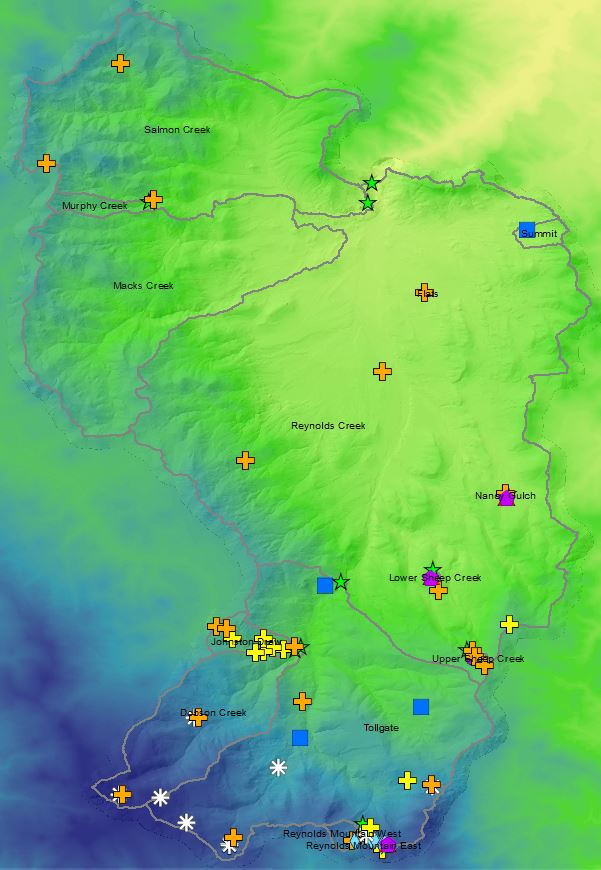
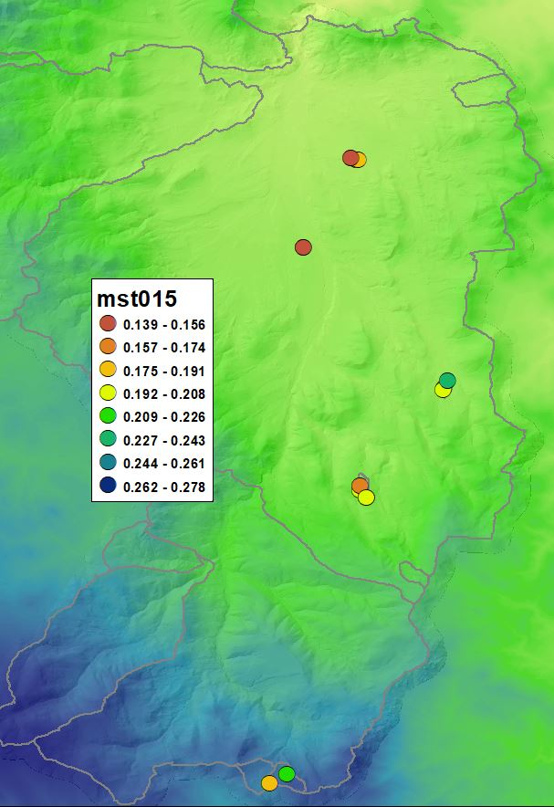
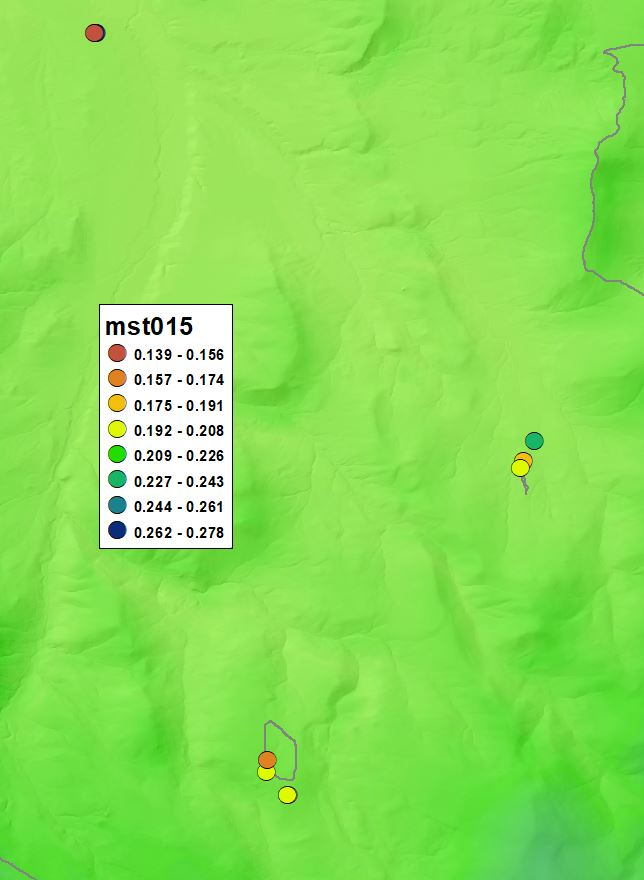
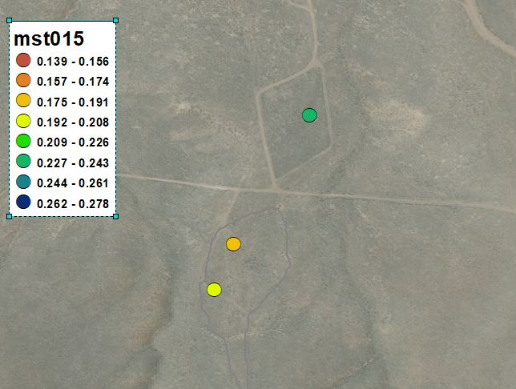
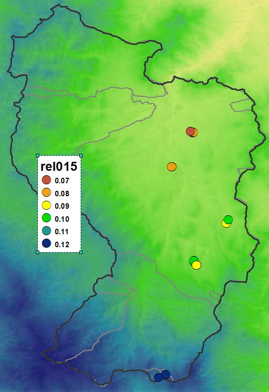
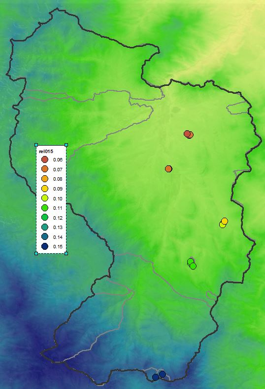

```{r echo=FALSE, message=FALSE}
library(dplyr)
library(tidyverse)
library(ggplot2)
library(knitr)
library(DT)

```
***
### Does soil moisture align with Kormos MAP raster?
***
<center>
<span style="font-size: 12px">Reynolds Creek mean annual precipitation</span>
<br>
{width=50%}
</center>
***
### ARS Neutron Probes
#### PART 1: Calculate mean annual soil moisture


<span style="text-decoration: underline">Notes:</span>

* Uses function to calc averages for each data file, then do.call to bind them together into one table
* Subsets the data to latest, most consistent sensor (probe=564), this cuts down down to 8-10 years (plenty)
* Mean annual value calculated by water year (October-September)
* Mean annual value built from monthly average to somewhat prevent any skew from uneven n per month


```{r}
# Calculate mean annual soil moisture (MASM) from ARS bimonthly data file
calc_MASM <- function(ars_sm_filename) {
  soil_mst <- read.csv(ars_sm_filename, as.is=T)
  soil_mst$datetime <- as.POSIXct(soil_mst$datetime)
  loc <- strsplit(ars_sm_filename,"-")[[1]][3]
  
  #Remove rows with missing data
  soil_mst[soil_mst == -999] <- NA
  
  #Create columns for month and year
  soil_mst$Month <- as.numeric(format(soil_mst$datetime,'%m'))
  soil_mst$Year <- as.numeric(format(soil_mst$datetime,'%Y'))
  
  #set numeric columns to remove any non-numerics
  suppressWarnings(
    soil_mst[2:ncol(soil_mst)] <- lapply(soil_mst[2:ncol(soil_mst)], as.numeric)
  )
  
  #Create column for water year (October-Sept)
    #Also try by growing season (March-July)
  soil_mst$Year_water <- ifelse(soil_mst$Month > 9, soil_mst$Year+1, soil_mst$Year)
  
  #Create monthly average dataset
  soil_mst_monthly <- soil_mst %>% group_by(Year_water, Month, probe) %>% summarise_all(mean) 
  
  #Use only probe 564
  mst_monthly_564 <- soil_mst_monthly %>% filter(probe == 564) 
  
  #Use monthly average to create annual mean, max, min
    #Doesn't calc for years missing data
  mst_annual_mean <- mst_monthly_564 %>% group_by(Year_water) %>% summarize_all(mean)
  #mst_annual_max <- mst_monthly_564 %>% group_by(Year_water) %>% summarize_all(max)
  #mst_annual_min <- mst_monthly_564 %>% group_by(Year_water) %>% summarize_all(min)
  
  #store number of years in annual dataset
  years_n <- nrow(na.omit(mst_annual_mean))
  
  #mean, max, min moisture values
  mean_annual_mst <- mst_annual_mean %>% select(-probe, -Month, -datetime, -Year) %>% na.omit() %>% summarize_all(mean) %>% 
                      select(-Year_water) %>% add_column(met = loc, .before = "mst015") %>% add_column(yrs_n = years_n , .after = "met")
  
  return(mean_annual_mst)
}


#set path to soil moisture data
soil_water_data_path <- "C:/Users/drkpi/Google Drive/RCrk/RC_SoDaH/RC_data/ARS_climate/neutron probe soil water/headers_removed/"

#get ARS siol moisture data files from path
soil_mst_files <- list.files(path=soil_water_data_path)
soil_mst_files <- soil_mst_files[!soil_mst_files %in% c('desktop.ini')]
path_soil_mst_files <- paste0(soil_water_data_path, soil_mst_files)

#Compile from all ARS files
comp_df <- sapply(path_soil_mst_files,calc_MASM)
MASM <- do.call(bind_rows, comp_df)

#write MASM
#write.csv(MASM, "C:/Users/drkpi/Google Drive/RCrk/RC_SoDaH/RC_data/ARS_climate/neutron probe soil water/MASM_pierson_fromR.csv")


# #QC plots used to check data 
# ggplot(soil_mst, aes(x=datetime, y=mst015, color=as.character(probe))) + geom_point(alpha=0.5) + ylim(0,0.4) + geom_line()
# 
# ggplot(soil_mst_monthly, aes(x=datetime, y=mst015, color=as.character(probe))) + geom_point(alpha=0.5) + ylim(0,0.4) + geom_line()
# 
# ggplot(mst_monthly_564, aes(x=datetime, y=mst015, color=as.character(Year_water))) + geom_point(alpha=0.5) + ylim(0,0.4) + geom_line()
# 
# ggplot(mst_annual_mean, aes(x=Year_water, y=mst015, color=as.character(Year_water))) + geom_point(alpha=0.5) + ylim(0,0.4) + geom_line()
# 


```


<details style="padding: 30px">
  <summary><span style="font-size: 16px">Click to see MASM Table</span></summary>
```{r echo=FALSE, results = 'asis'}
kable(MASM[1:15,1:15], caption="Mean annual soil moisture table", digits=3)
print("End Table")
```
</details> 


***  

#### PART 2: Map RC Mean Annual Soil Moisture (MASM)

<center>
<span style="font-size: 14px">Reynolds Creek mean annual soil moisture @ 15 cm</span>
<br>
mst = ARS **"Observed"** Volumetric Soil Moisture
<br>
**Broad elevation trend, but high local variability**
<br>
{width=40%}
<br>

<br>
**Zooming in:   **
{width=40%}
{width=40%}

</center>

***
#### Changing data for map from raw "mst" to corrected "rel" 
**Relative Corrected Volumetric Soil Moisture is much better (...Calculation used by ARS?)** 

<br>
<center>
{width=40%}

```{r echo=FALSE}
MASM_map <- read.csv("C:/Users/drkpi/Google Drive/RCrk/RC_SoDaH/RC_data/ARS_climate/neutron probe soil water/summary_pierson/ARS_masm_map_data.csv")

ggplot(MASM_map, aes(x=Kormos_MAP, y=rel015, color=Kormos_MAP)) + geom_point(size=3) +
  xlab("Mean Annual Precip (mm)") + ylab("0-15cm Volumetric Soil Moisture [ARS rel015]")


```


</center>
<br>

***

#### PART 3: Map RC Growing Season Soil Moisture (GSSM)
Is moisture in cold months relevant? Bulk of microbial processing in spring-summer?

```{r}
# Calculate mean annual soil mositure (MASM) from ARS bimonthly data file
calc_GSSM <- function(ars_sm_filename) {
  
  #DEBUG
  #ars_sm_filename <- path_soil_mst_files[1]
  
  soil_mst <- read.csv(ars_sm_filename, as.is=T)
  soil_mst$datetime <- as.POSIXct(soil_mst$datetime)
  loc <- str_split(ars_sm_filename,"-")[[1]][3]
  
  #Remove rows with missing data
  soil_mst[soil_mst == -999] <- NA
  
  #Create columns for month and year
  soil_mst$Month <- as.numeric(format(soil_mst$datetime,'%m'))
  soil_mst$Year <- as.numeric(format(soil_mst$datetime,'%Y'))
  
  #set numeric columns to remove any non-numerics
  suppressWarnings(
    soil_mst[2:ncol(soil_mst)] <- lapply(soil_mst[2:ncol(soil_mst)], as.numeric)
  )
  
  #Create column for water year (October-Sept)
  soil_mst$Year_water <- ifelse(soil_mst$Month > 9, soil_mst$Year+1, soil_mst$Year)
  
  #Create monthly average over the growing season ONLY (March-July)
  soil_mst_growseas <- soil_mst %>% filter(Month > 2) %>% filter(Month<8) %>%
                        group_by(Year_water, Month, probe) %>% summarise_all(mean) 
  
  #Use only probe 564
  mst_monthly_564 <- soil_mst_growseas %>% filter(probe == 564) 
  
  #Use monthly average to create annual mean, max, min
    #Doesn't calc for years missing data
  mst_annual_mean <- mst_monthly_564 %>% group_by(Year_water) %>% summarize_all(mean)
  #mst_annual_max <- mst_monthly_564 %>% group_by(Year_water) %>% summarize_all(max)
  #mst_annual_min <- mst_monthly_564 %>% group_by(Year_water) %>% summarize_all(min)
  
  #store number of years in annual dataset
  years_n <- nrow(na.omit(mst_annual_mean))
  
  #mean, max, min moisture values
  mean_annual_mst <- mst_annual_mean %>% select(-probe, -Month, -datetime, -Year) %>% na.omit() %>% summarize_all(mean) %>% 
                      select(-Year_water) %>% add_column(met = loc, .before = "mst015") %>% add_column(yrs_n = years_n , .after = "met")
  
  return(mean_annual_mst)
}


#set path to soil moisture data
soil_water_data_path <- "C:/Users/drkpi/Google Drive/RCrk/RC_SoDaH/RC_data/ARS_climate/neutron probe soil water/headers_removed/"

#get ARS siol moisture data files from path
soil_mst_files <- list.files(path=soil_water_data_path)
soil_mst_files <- soil_mst_files[!soil_mst_files %in% c('desktop.ini')]
path_soil_mst_files <- paste0(soil_water_data_path, soil_mst_files)

#get GSSM from specific data file
df <- calc_GSSM(path_soil_mst_files[1])


#Compile from all ARS files
comp_df <- sapply(path_soil_mst_files,calc_GSSM)
GSSM <- do.call(bind_rows,comp_df)

#save MASM
#write.csv(GSSM, paste0(soil_water_data_path,"calc_GSSM.csv"))
```
<details style="padding: 30px">
  <summary><span style="font-size: 16px">Click to see GSSM Table</span></summary>
```{r echo=FALSE, results = 'asis'}
kable(GSSM[1:15,1:15], caption="Mean annual growing season soil moisture table", digits=3)
print("End Table")
```
</details> 

<br>
<center>
{width=40%}

```{r echo=FALSE}
GSSM_map <- read.csv("C:/Users/drkpi/Google Drive/RCrk/RC_SoDaH/RC_data/ARS_climate/neutron probe soil water/summary_pierson/ARS_gssm_map_data.csv")

ggplot(GSSM_map, aes(x=Kormos_MAP, y=rel015, color=Kormos_MAP)) + geom_point(size=3) +
  xlab("Mean Annual Precip (mm)") + ylab("0-15cm Growing Season Soil Moisture [rel015]")


```

</center>

***

### In Conclusion
##### 1. How did ARS calculate relative soil moisture?
##### 2. Full year vs. growing season doesn't matter much.
##### 3. At the RC watershed scale we can fit MAP to soil moisture quite well for use in MIMICS. 
##### 4. I don't expect using soil moisture data across RCrk to improve model residuals. We still need to dive into soil mositure in relation to aspect and snow. However, the positive is that we can tie MAP to soil moisture and use that relationship in areas where we have no soil moisture data.
##### 5. From here, I'd like to determine if we can use aspect (and perhaps elevation, canopy cover?), as a scalar for soil moisture. For this to work best, I'd need data for soil moisture by opposing N/S aspects in multiple elevation zones across RCrk. 

***

### Next up:
#### [Johnston Draw soil moisture analysis](http://example.com)

***

<div style="font-size: 10px; color: #555555">
Derek Pierson
Last modified: 11/19/20
</div>

